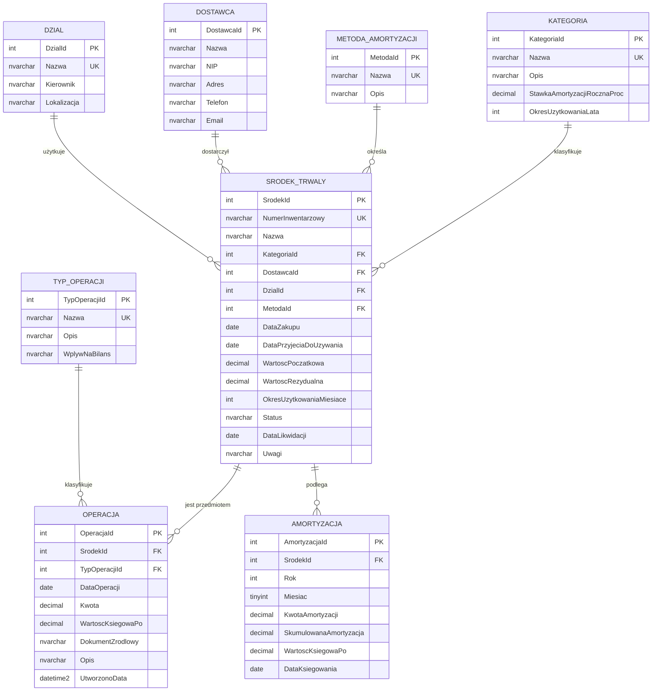

# Model bazy danych — system zarządzania środkami trwałymi

Diagram ERD i opis modelu dla projektu IFS 9 + MS SQL (scenariusze 2 i 3).

---

## Diagram ERD (Mermaid)

> Ten diagram renderuje się automatycznie w Cursor / VS Code / GitHub. Żeby wyeksportować do PNG/SVG na raport — skopiuj poniższy blok i wklej w **[mermaid.live](https://mermaid.live)**, potem **Actions → PNG/SVG**.

---

## Opis encji

### Tabele słownikowe

**`Kategoria`** — typ środka trwałego (komputer, maszyna produkcyjna, pojazd, wyposażenie biurowe). Każda kategoria niesie domyślną stawkę amortyzacji rocznej i sugerowany okres użytkowania — to pomaga w księgowej klasyfikacji nowych ŚT.

**`MetodaAmortyzacji`** — sposób rozłożenia kosztu w czasie: liniowa, degresywna, jednorazowa, naturalna. Wybór metody ma istotny wpływ na rozkład kosztów w czasie i wynik finansowy w poszczególnych latach.

**`Dostawca`** — kontrahent, od którego nabyto środek trwały (NIP, adres, kontakt).

**`Dzial`** — komórka organizacyjna, w której środek jest użytkowany (IT, Produkcja, Logistyka). Używana do analiz kosztowych "per dział".

**`TypOperacji`** — kategoria zdarzenia w historii środka: zakup, amortyzacja, sprzedaż, likwidacja, modernizacja, przeszacowanie. Każdy typ ma cechę `WplywNaBilans` (`zwieksza` / `zmniejsza` / `neutralny`) — umożliwia szybką agregację wpływu finansowego.

### Tabela główna

**`SrodekTrwaly`** — rejestr środków trwałych. Każdy ŚT ma unikalny numer inwentarzowy, jest powiązany z kategorią, dostawcą, działem, wybraną metodą amortyzacji. Zawiera kluczowe dane finansowe (wartość początkowa, rezydualna, okres użytkowania w miesiącach) oraz status (`aktywny`, `sprzedany`, `zlikwidowany`, `w_naprawie`).

### Tabele transakcyjne

**`Operacja`** — kompletna historia wszystkich zdarzeń dotyczących ŚT (audit trail). Każdy wpis zawiera datę, kwotę, wartość księgową **po** operacji oraz dokument źródłowy (np. faktura zakupu, faktura sprzedaży, dokument LT/LN). Tabela pokrywa scenariusz 3 (historia + symulacja zdarzeń).

**`Amortyzacja`** — harmonogram odpisów amortyzacyjnych miesiąc po miesiącu. Zawiera kwotę odpisu, narastającą sumę amortyzacji i wartość księgową netto. Ograniczenie `UQ(SrodekId, Rok, Miesiac)` gwarantuje, że dla jednego środka nie ma dwóch odpisów w tym samym miesiącu. Tabela pokrywa scenariusz 2 (analiza wartości księgowych).

---

## Relacje

| Relacja | Kardynalność | Opis |
|---|---|---|
| Kategoria → SrodekTrwaly | 1 : N | Jedna kategoria może opisywać wiele ŚT |
| MetodaAmortyzacji → SrodekTrwaly | 1 : N | Jedna metoda może być zastosowana do wielu ŚT |
| Dostawca → SrodekTrwaly | 1 : N (opcjonalna) | Jeden dostawca może dostarczyć wiele ŚT; ŚT może nie mieć dostawcy (np. wytworzony własnym sumptem) |
| Dzial → SrodekTrwaly | 1 : N | Jeden dział użytkuje wiele ŚT |
| SrodekTrwaly → Operacja | 1 : N | Jeden ŚT ma wiele operacji w historii |
| SrodekTrwaly → Amortyzacja | 1 : N | Jeden ŚT ma wiele odpisów amortyzacyjnych |
| TypOperacji → Operacja | 1 : N | Jeden typ klasyfikuje wiele operacji |

Wszystkie klucze obce mają domyślnie `ON DELETE NO ACTION` (nie kasujemy historii operacji automatycznie przy usunięciu ŚT — chroni audyt).

---

## Normalizacja

Model jest w **3NF (trzecia postać normalna)**:

- **1NF** — wszystkie atrybuty są atomowe (brak wielowartościowych pól).
- **2NF** — brak częściowych zależności od klucza złożonego (klucze są jednokolumnowe `IDENTITY`).
- **3NF** — brak zależności przechodnich; np. nazwa kategorii nie powtarza się w `SrodekTrwaly`, tylko klucz obcy.

---

## Założenia projektowe i decyzje

1. **Dwie tabele transakcyjne (`Operacja` i `Amortyzacja`)** zamiast jednej — `Amortyzacja` jest specjalizowanym harmonogramem z dodatkowymi atrybutami (rok, miesiąc, narastająca suma), `Operacja` to ogólny dziennik zdarzeń. Każdy odpis pojawia się w obu tabelach (raz jako wpis harmonogramu, raz jako wpis w dzienniku), co odzwierciedla podejście stosowane w IFS 9 (osobny ekran „Depreciation Plan” i „Transaction History”).

2. **Status środka trwałego** trzymany w `SrodekTrwaly.Status` zamiast wyliczania go za każdym razem z `Operacja` — wydajniejsze przy zapytaniach analitycznych, kosztem konieczności aktualizacji statusu po zdarzeniu kończącym (UPDATE wewnątrz transakcji).

3. **`WartoscKsiegowaPo`** zapisywana w każdej operacji — zamrożenie wartości w momencie zdarzenia (snapshot). Pozwala odtworzyć stan ksiąg na dowolny moment w przeszłości bez przeliczania całego harmonogramu od początku.

4. **CHECK constraints** na `Status`, `WplywNaBilans`, zakresy miesiąca, dodatnich wartości — egzekwują integralność danych już na poziomie bazy, niezależnie od aplikacji.

5. **Indeksy** na `Operacja(SrodekId, DataOperacji)` i `Amortyzacja(SrodekId, Rok, Miesiac)` — wszystkie zapytania w scenariuszach 2 i 3 filtrują/sortują po tych kolumnach.

---

## Statystyki modelu

| Element | Liczba |
|---|---|
| Tabele słownikowe | 5 |
| Tabele transakcyjne | 2 |
| Tabela główna | 1 |
| Klucze obce | 6 |
| Indeksy (poza PK) | 3 |
| Ograniczenia CHECK | 10 |
| Ograniczenia UNIQUE | 5 |

---

## Mapowanie na encje IFS 9

| Encja w modelu | Odpowiednik w IFS 9 (przedmiot: Fixed Assets) |
|---|---|
| SrodekTrwaly | Object (`FA_OBJECT_TAB`) |
| Kategoria | Object Type / Object Group |
| Operacja | Transaction (`FA_TRANSACTION_TAB`) |
| Amortyzacja | Depreciation Plan (`FA_DEPR_PLAN_TAB`) |
| MetodaAmortyzacji | Depreciation Method |
| Dostawca | Supplier |
| Dzial | Cost Center / Department |
| TypOperacji | Transaction Type |

Mapowanie świadomie uproszczone — model nie odtwarza pełnej złożoności IFS-a (np. brak wielo-księgowości, walut, części obiektu), bo to wykraczałoby poza zakres projektu zaliczeniowego.
